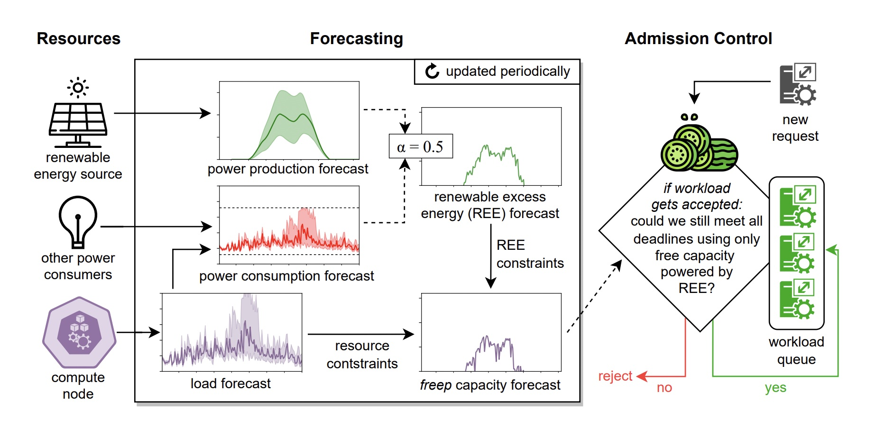

# Cucumber

A configurable admission control for resource-constrained compute nodes with on-site renewable energy sources.



Cucumber accepts delay-tolerant workloads in a way that increases renewable excess power utilization through probabilistic multistep-ahead forecasts of computational load, energy consumption, and energy production.

This repository contains datasets, simulation code, and analysis notebooks used in the evaluation of the paper "Cucumber: Renewable-Aware Admission Control for Delay-Tolerant Cloud and Edge Workloads".

## Data

The `data` directory contains all input data for the simulation.

### Capacity Forecasts

`data/u_<scenario>_<solar_site>` contains the capacity forecasts for a `<scenario>` x `<solar_site>` combination.
Each line represents a forecast result and is indexed by a multi-index where level 1 is the datetime of the forecast request and level 2 the datetime of the forecast result.

For each forecast result the following information is available:
- `u_free`: Actual free capacity
- `u_free_pred`: Forecasted free capacity
- `u_reep`: Actual capacity which can be powered by renewable excess energy
- `u_reep_pred_expected`: Forecasted capacity which can be powered by renewable excess energy (expected case)
- `u_reep_pred_conservative`: Forecasted capacity which can be powered by renewable excess energy (conservative case)
- `u_reep_pred_optimistic`: Forecasted capacity which can be powered by renewable excess energy (optimistic case)

### Workload Requests

`data/requests_<scenario>` contains the requests for delay-tolerant workloads that Cucumber can accept/reject during the simulation.
Each line contains the arrival time, deadline, and size of the workload request.


## Simulation and Analysis

The `evaluation` directory contains a [SimPy](https://simpy.readthedocs.io/en/latest/) simulation used for evaluating Cucumber.
To run the simulation, you need Python 3.7 or newer and install the dependencies in `requirements.txt`, e.g. via:

```
python3 -m venv venv  			# create venv
. venv/bin/activate   			# activate venv
pip3 install -r requirements.txt	# install dependencies
```

Now execute the simulation via:

```
cd evaluation
python main.py
```

All output files of this step are in directory `results`:
- `results/u_<scenario>_<solar_site>_<policy>`: Capacity usage statistics for each experiment (e.g. available spare capacity, green excess capacity, actually used capacity)
- `results/jobs_<scenario>_<solar_site>_<policy>`: Workload statistics for each experiment (e.g. arrival time, finish time, deadline)

The `analysis.ipynb` notebook analyzes the results and generates the plots presented in the paper, you can start it via:

```
jupyter lab
```


## Publication

Cite as:

- Philipp Wiesner, Dominik Scheinert, Thorsten Wittkopp, Lauritz Thamsen, and Odej Kao. "Cucumber: Renewable-Aware Admission Control for Delay-Tolerant Cloud and Edge Workloads" In the Proceedings of the *28th International European Conference on Parallel and Distributed Computing (Euro-Par)*. Springer. 2022. [[arXiv preprint]](https://arxiv.org/pdf/2205.02895.pdf)

Bibtex:
```
@inproceedings{Wiesner_Cucumber_2022,
  author={Wiesner, Philipp and Scheinert, Dominik and Wittkopp, Thorsten and Thamsen, Lauritz and Kao, Odej},
  booktitle={28th International European Conference on Parallel and Distributed Computing (Euro-Par)}, 
  title={Cucumber: Renewable-Aware Admission Control for Delay-Tolerant Cloud and Edge Workloads}, 
  publisher={Springer}
  year={2022}
}
```
